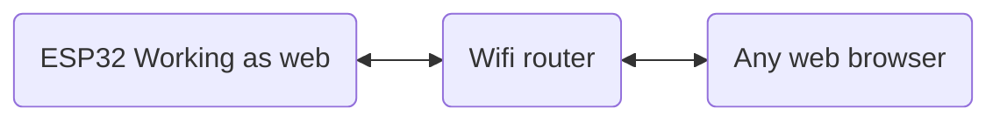

## This is a simple web socket server created by using ESP32/ESP8266.


[Setup ESP8266](https://randomnerdtutorials.com/how-to-install-esp8266-board-arduino-ide/)

[Setup ESP32](https://randomnerdtutorials.com/installing-the-esp32-board-in-arduino-ide-windows-instructions/)

[Reference Materials](https://arduino.stackexchange.com/questions/68319/websocketsserver-h-no-such-file-or-directory)

#### To access , copy and paste IP address on web browser


#### On web browser accessing using ip add address in serial monitor


### More in depth

1. Add UserName and PassWord of the wifi router
```cpp
const char* ssid = "UN";
const char* password = "PW";
```
2. Here in-build LED has consider for testing(this may change from board type)
```cpp
const int bulbPin = 4; // change this accordingly
```

